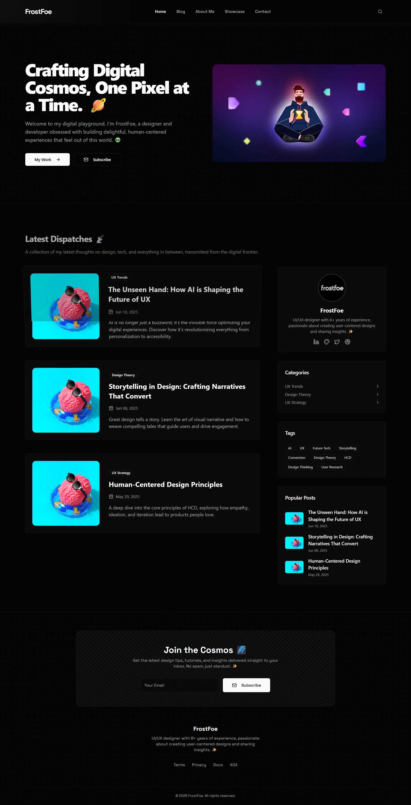
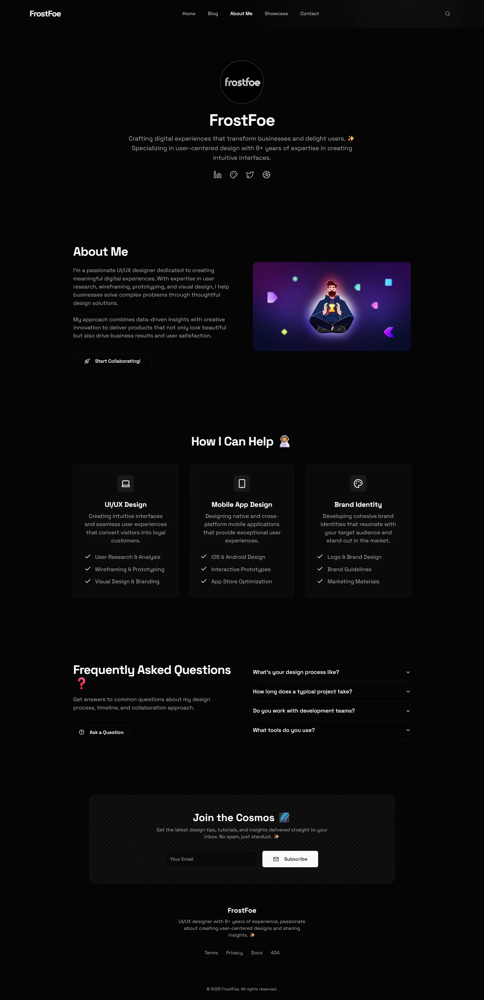
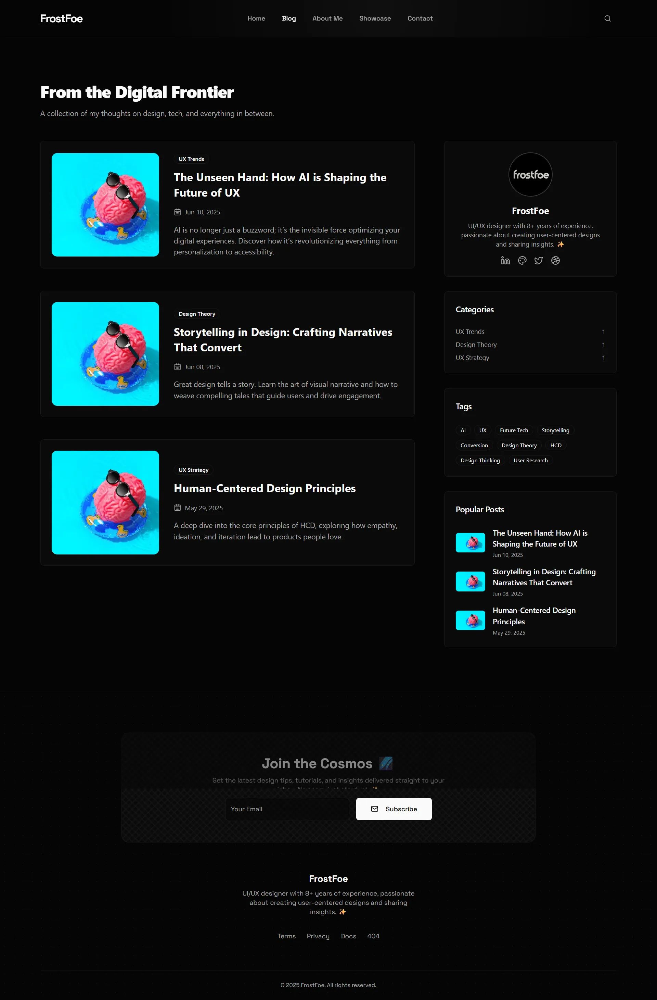

  

  🔗 <strong>Live Preview:</strong> <a href="https://ff-nextjs-portfolio-01.netlify.app/" target="_blank">ff-nextjs-portfolio-01.netlify.app</a>

---

## ✨ Main Features

- **Portfolio Showcase:** A dedicated section to showcase projects.
- **MDX Blog:** A blog with posts written in MDX, allowing for rich content with components.
- **Search Functionality:** A search feature for finding content within the site.
- **Categorization and Tagging:** Blog posts can be organized with categories and tags.
- **Responsive Design:** The website is designed to work on various screen sizes.
- **Interactive Elements:** Includes animations and particle effects for a dynamic user experience.
- **Comments Section:** Allows users to leave comments on blog posts.
- **Static Site Generation (SSG):** Leverages Next.js for fast performance and SEO benefits.

## 🛠️ Technologies Used

- **Framework:** [Next.js](https://nextjs.org/)
- **Language:** [TypeScript](https://www.typescriptlang.org/)
- **Styling:** [Tailwind CSS](https://tailwindcss.com/)
- **Content:** [MDX](https://mdxjs.com/)
- **Animation:** [Framer Motion](https://www.framer.com/motion/), [tsParticles](https://particles.js.org/)
- **Form Handling:** [React Hook Form](https://react-hook-form.com/), [Zod](https://zod.dev/)
- **UI Components:** [Radix UI](https://www.radix-ui.com/), [Lucide React](https://lucide.dev/)
- **Linting/Formatting:** [ESLint](https://eslint.org/), [Prettier](https://prettier.io/)

## 🖼️ Screenshots

### Home Page

### About Page

### Blog Page

© 2025 FrostFoe. All rights reserved.
